# RRR Database Reference

The runtime data store is a single SQLite file. On installed devices it lives
at `~/rrr/shared/data/rrr_database.db`; on a developer clone it falls back to
`Project/rrr_database.db` (both resolved through
[`utils.paths.database_path()`](../Project/utils/paths.py)). The whole schema
and every read/write path is owned by
[`Project/models/database_handler.py`](../Project/models/database_handler.py);
no other module issues SQL directly.

This document is the single source of truth for the schema, intended for
developers extending the app. **If you change the schema, update this file in
the same commit.**

---

## 1. Schema (ERD)

GitHub renders the diagram below natively. Key columns only — see §2 for the
full DDL.

```mermaid
erDiagram
    TRAINERS ||--o{ ANIMALS                       : owns
    TRAINERS ||--o{ SCHEDULES                     : creates
    TRAINERS ||--o{ LOGS                          : performs
    TRAINERS ||--o{ VALVE_CALIBRATION             : calibrates
    TRAINERS ||--o{ VALVE_CALIBRATION_HISTORY     : calibrates

    SCHEDULES ||--o{ SCHEDULE_ANIMALS             : "has rows"
    ANIMALS   ||--o{ SCHEDULE_ANIMALS             : "is in"
    RELAY_UNITS ||--o{ SCHEDULE_ANIMALS           : "assigned to"

    SCHEDULES ||--o{ SCHEDULE_DESIRED_OUTPUTS     : ""
    ANIMALS   ||--o{ SCHEDULE_DESIRED_OUTPUTS     : ""

    SCHEDULES ||--o{ SCHEDULE_INSTANT_DELIVERIES  : ""
    ANIMALS   ||--o{ SCHEDULE_INSTANT_DELIVERIES  : ""
    RELAY_UNITS ||--o{ SCHEDULE_INSTANT_DELIVERIES : ""

    SCHEDULES ||--o{ SCHEDULE_STAGGERED_WINDOWS   : ""
    ANIMALS   ||--o{ SCHEDULE_STAGGERED_WINDOWS   : ""

    SCHEDULES ||--o{ CYCLE_TRACKING               : ""
    ANIMALS   ||--o{ CYCLE_TRACKING               : ""

    SCHEDULES ||--o{ DISPENSING_HISTORY           : ""
    ANIMALS   ||--o{ DISPENSING_HISTORY           : ""
    RELAY_UNITS ||--o{ DISPENSING_HISTORY         : ""

    TRAINERS {
        int  trainer_id    PK
        text trainer_name  UK
        text salt
        text password
        text role
    }
    ANIMALS {
        int  animal_id      PK
        text lab_animal_id  UK
        text name
        int  trainer_id     FK
        real last_weight
        text last_watering
        text sex
    }
    RELAY_UNITS {
        int  relay_unit_id  PK
        text relay_ids
    }
    SCHEDULES {
        int  schedule_id        PK
        text name
        real water_volume
        text start_time
        text end_time
        int  created_by         FK
        bool is_super_user
        text delivery_mode
        text dispensing_status
    }
    SCHEDULE_ANIMALS {
        int schedule_id    PK_FK
        int animal_id      PK_FK
        int relay_unit_id  FK
    }
    SCHEDULE_DESIRED_OUTPUTS {
        int  schedule_id         PK_FK
        int  animal_id           PK_FK
        real desired_output
        int  interval_minutes
        real volume_per_interval
    }
    SCHEDULE_INSTANT_DELIVERIES {
        int  delivery_id        PK
        int  schedule_id        FK
        int  animal_id          FK
        int  relay_unit_id      FK
        text delivery_datetime
        real water_volume
        bool completed
    }
    SCHEDULE_STAGGERED_WINDOWS {
        int  window_id        PK
        int  schedule_id      FK
        int  animal_id        FK
        text start_time
        text end_time
        real target_volume
        real delivered_volume
        text status
    }
    CYCLE_TRACKING {
        int  tracking_id      PK
        int  schedule_id      FK
        int  animal_id        FK
        int  cycle_index
        text start_time
        text end_time
        real target_volume
        real delivered_volume
        text status
        text completed_at
    }
    DISPENSING_HISTORY {
        int  history_id       PK
        int  schedule_id      FK
        int  animal_id        FK
        int  relay_unit_id    FK
        text timestamp
        real volume_dispensed
        text status
        int  cycle_index
    }
    LOGS {
        int  log_id         PK
        text timestamp
        text action
        int  super_user_id  FK
        text details
    }
    SYSTEM_SETTINGS {
        text setting_key    PK
        text setting_value
        text setting_type
        text updated_at
    }
    VALVE_CALIBRATION {
        int  calibration_id      PK
        int  cage_id             UK
        int  relay_id
        int  pulse_width_ms
        real volume_per_pulse_ml
        int  num_samples
        text calibration_date
        int  calibrated_by       FK
    }
    VALVE_CALIBRATION_HISTORY {
        int  history_id          PK
        int  cage_id
        int  relay_id
        int  pulse_width_ms
        real volume_per_pulse_ml
        int  num_samples
        text calibration_date
        int  calibrated_by       FK
    }
    CAGE_NAMES {
        int  cage_id     PK
        int  relay_id
        text name
        text description
        text created_at
        text updated_at
    }
```



**Three orphan tables** are intentionally not connected by FKs:

- **`system_settings`** — a key/value store; the canonical home for app
  preferences since Phase 2.5a (v1.5.0). See §6.
- **`cage_names`** — `relay_id` is stored as a plain `INTEGER`, *not* a FK to
  `relay_units`. The application assigns the relay-to-cage mapping by
  convention.
- **`valve_calibration_history`** — mirrors `valve_calibration` and is written
  to on every recalibration (audit trail). There is no FK between the two.

**Important caveat — FKs are declared but not enforced.** The database is
opened without `PRAGMA foreign_keys = ON`, so the FK declarations above are
*documentation*, not runtime constraints. Deleting a row referenced elsewhere
will succeed and leave dangling IDs. See §7.

---

## 2. Table reference (verbatim DDL)

All DDL lives inside
[`DatabaseHandler.create_tables()`](../Project/models/database_handler.py)
(lines 23–274) and runs idempotently on every startup (`CREATE TABLE IF NOT
EXISTS` everywhere except the single inline migration for `dispensing_history`
— see §4).

### Auth & users

```sql
CREATE TABLE IF NOT EXISTS trainers (
    trainer_id   INTEGER PRIMARY KEY AUTOINCREMENT,
    trainer_name TEXT    UNIQUE NOT NULL,
    salt         TEXT    NOT NULL,
    password     TEXT    NOT NULL,           -- SHA-256(salt + plaintext)
    role         TEXT    DEFAULT 'normal'    -- 'normal' | 'super'
);
```

### Animals & cages

```sql
CREATE TABLE IF NOT EXISTS animals (
    animal_id         INTEGER PRIMARY KEY AUTOINCREMENT,
    lab_animal_id     TEXT    UNIQUE NOT NULL,
    name              TEXT    NOT NULL,
    initial_weight    REAL,
    last_weight       REAL,
    last_weighted     TEXT,
    last_watering     TEXT,
    last_water_volume REAL,
    trainer_id        INTEGER,
    sex               TEXT CHECK(sex IN ('male', 'female')) DEFAULT NULL,
    FOREIGN KEY(trainer_id) REFERENCES trainers(trainer_id)
);

CREATE TABLE IF NOT EXISTS cage_names (
    cage_id     INTEGER PRIMARY KEY,           -- application-assigned, not AUTOINCREMENT
    relay_id    INTEGER NOT NULL,              -- not a FK; see §1
    name        TEXT    NOT NULL DEFAULT '',
    description TEXT    DEFAULT '',
    created_at  TEXT    NOT NULL,
    updated_at  TEXT    NOT NULL
);
```

### Hardware

```sql
CREATE TABLE IF NOT EXISTS relay_units (
    relay_unit_id INTEGER PRIMARY KEY AUTOINCREMENT,
    relay_ids     TEXT    NOT NULL             -- comma-delimited integer list
);
```

### Scheduling

```sql
CREATE TABLE IF NOT EXISTS schedules (
    schedule_id       INTEGER PRIMARY KEY AUTOINCREMENT,
    name              TEXT    NOT NULL,
    water_volume      REAL    NOT NULL,
    start_time        TEXT    NOT NULL,
    end_time          TEXT    NOT NULL,
    created_by        INTEGER NOT NULL,
    is_super_user     BOOLEAN DEFAULT 0,
    delivery_mode     TEXT    DEFAULT 'staggered',  -- 'staggered' | 'instant'
    dispensing_status TEXT    DEFAULT 'pending',
    FOREIGN KEY(created_by) REFERENCES trainers(trainer_id)
);

CREATE TABLE IF NOT EXISTS schedule_animals (
    schedule_id   INTEGER NOT NULL,
    animal_id     INTEGER NOT NULL,
    relay_unit_id INTEGER,
    PRIMARY KEY (schedule_id, animal_id),
    FOREIGN KEY(schedule_id)   REFERENCES schedules(schedule_id),
    FOREIGN KEY(animal_id)     REFERENCES animals(animal_id),
    FOREIGN KEY(relay_unit_id) REFERENCES relay_units(relay_unit_id)
);

CREATE TABLE IF NOT EXISTS schedule_desired_outputs (
    schedule_id         INTEGER NOT NULL,
    animal_id           INTEGER NOT NULL,
    desired_output      REAL    NOT NULL,
    interval_minutes    INTEGER DEFAULT 60,
    volume_per_interval REAL,
    PRIMARY KEY (schedule_id, animal_id),
    FOREIGN KEY(schedule_id) REFERENCES schedules(schedule_id),
    FOREIGN KEY(animal_id)   REFERENCES animals(animal_id)
);

CREATE TABLE IF NOT EXISTS schedule_instant_deliveries (
    delivery_id       INTEGER PRIMARY KEY AUTOINCREMENT,
    schedule_id       INTEGER NOT NULL,
    animal_id         INTEGER NOT NULL,
    delivery_datetime TEXT    NOT NULL,
    water_volume      REAL    NOT NULL,
    relay_unit_id     INTEGER,
    completed         BOOLEAN DEFAULT 0,
    FOREIGN KEY(schedule_id)   REFERENCES schedules(schedule_id),
    FOREIGN KEY(animal_id)     REFERENCES animals(animal_id),
    FOREIGN KEY(relay_unit_id) REFERENCES relay_units(relay_unit_id)
);

CREATE TABLE IF NOT EXISTS schedule_staggered_windows (
    window_id        INTEGER PRIMARY KEY AUTOINCREMENT,
    schedule_id      INTEGER NOT NULL,
    animal_id        INTEGER NOT NULL,
    start_time       TEXT    NOT NULL,
    end_time         TEXT    NOT NULL,
    target_volume    REAL    NOT NULL,
    delivered_volume REAL    DEFAULT 0,
    status           TEXT    DEFAULT 'pending',
    FOREIGN KEY(schedule_id) REFERENCES schedules(schedule_id),
    FOREIGN KEY(animal_id)   REFERENCES animals(animal_id)
);

CREATE TABLE IF NOT EXISTS cycle_tracking (
    tracking_id      INTEGER PRIMARY KEY AUTOINCREMENT,
    schedule_id      INTEGER NOT NULL,
    animal_id        INTEGER NOT NULL,
    cycle_index      INTEGER NOT NULL,
    start_time       TEXT    NOT NULL,
    end_time         TEXT    NOT NULL,
    target_volume    REAL    NOT NULL,
    delivered_volume REAL    DEFAULT 0,
    status           TEXT    DEFAULT 'pending',
    completed_at     TEXT,
    FOREIGN KEY(schedule_id) REFERENCES schedules(schedule_id),
    FOREIGN KEY(animal_id)   REFERENCES animals(animal_id)
);
```

### Telemetry

```sql
CREATE TABLE dispensing_history (
    history_id       INTEGER PRIMARY KEY AUTOINCREMENT,
    schedule_id      INTEGER NOT NULL,
    animal_id        INTEGER NOT NULL,
    relay_unit_id    INTEGER NOT NULL,
    timestamp        TEXT    NOT NULL,
    volume_dispensed REAL    NOT NULL,
    status           TEXT    NOT NULL,
    cycle_index      INTEGER DEFAULT NULL,    -- added by inline migration
    FOREIGN KEY(schedule_id)   REFERENCES schedules(schedule_id),
    FOREIGN KEY(animal_id)     REFERENCES animals(animal_id),
    FOREIGN KEY(relay_unit_id) REFERENCES relay_units(relay_unit_id)
);

CREATE TABLE IF NOT EXISTS logs (
    log_id        INTEGER PRIMARY KEY AUTOINCREMENT,
    timestamp     TEXT    NOT NULL,
    action        TEXT    NOT NULL,
    super_user_id INTEGER NOT NULL,
    details       TEXT,
    FOREIGN KEY(super_user_id) REFERENCES trainers(trainer_id)
);
```

### App configuration

```sql
CREATE TABLE IF NOT EXISTS system_settings (
    setting_key   TEXT PRIMARY KEY,
    setting_value TEXT NOT NULL,            -- serialised; see §6
    setting_type  TEXT NOT NULL,            -- 'bool' | 'int' | 'float' | 'json' | 'str'
    updated_at    TEXT NOT NULL
);
```

### Calibration

```sql
CREATE TABLE IF NOT EXISTS valve_calibration (
    calibration_id              INTEGER PRIMARY KEY AUTOINCREMENT,
    cage_id                     INTEGER NOT NULL UNIQUE,
    relay_id                    INTEGER NOT NULL,
    pulse_width_ms              INTEGER NOT NULL,
    volume_per_pulse_ml         REAL    NOT NULL,
    stddev_ml                   REAL,
    coefficient_of_variation_pct REAL,
    num_samples                 INTEGER NOT NULL,
    calibration_date            TEXT    NOT NULL,
    calibrated_by               INTEGER,
    notes                       TEXT,
    FOREIGN KEY(calibrated_by) REFERENCES trainers(trainer_id)
);

CREATE TABLE IF NOT EXISTS valve_calibration_history (
    history_id                  INTEGER PRIMARY KEY AUTOINCREMENT,
    cage_id                     INTEGER NOT NULL,   -- intentionally NOT UNIQUE
    relay_id                    INTEGER NOT NULL,
    pulse_width_ms              INTEGER NOT NULL,
    volume_per_pulse_ml         REAL    NOT NULL,
    stddev_ml                   REAL,
    coefficient_of_variation_pct REAL,
    num_samples                 INTEGER NOT NULL,
    calibration_date            TEXT    NOT NULL,
    calibrated_by               INTEGER,
    notes                       TEXT,
    FOREIGN KEY(calibrated_by) REFERENCES trainers(trainer_id)
);
```

---

## 3. Connection model

```python
def __init__(self, db_path=None):
    self.db_path = db_path or paths.database_path()
    self.create_tables()

def connect(self):
    return sqlite3.connect(self.db_path)
```

- **One connection per call.** Every public method opens a new `sqlite3`
  connection inside a `with self.connect() as conn:` block and lets the context
  manager commit/rollback. There is no `self.conn`, no pool.
- **No pragmas set.** Journal mode is the SQLite default (DELETE, *not* WAL);
  `PRAGMA foreign_keys` is OFF; `PRAGMA synchronous` is the default.
- **Thread-safety story:** the per-call pattern is safe because each thread
  gets its own connection. Concurrent *writes* serialise on the database file
  lock (no WAL). For the RRR's workload — one GUI thread + one delivery
  worker — this is fine; do not assume it scales beyond that.

If you ever need to add a method, **do not** add `self.conn = ...` to
`__init__`; keep the per-call pattern.

---

## 4. Inline migrations

The two existing schema changes are not run from a migration framework — they
are inline `PRAGMA table_info(...)` + `ALTER TABLE ... ADD COLUMN ...`
sequences inside `create_tables()`. Both run idempotently on every startup.

| Migration | What it does | Location |
|---|---|---|
| `dispensing_history.cycle_index` | If the table pre-dates the column, add it with `DEFAULT NULL`. | `database_handler.py:30–55` |
| `animals.sex` | Add a nullable `sex TEXT CHECK(sex IN ('male','female'))` if absent. | `database_handler.py:260–267` |

When you need a third migration, add it to `create_tables()` in the same
style; *do not* introduce a parallel framework — see [`docs/UPDATE_SYSTEM.md`
§14.5 F4](UPDATE_SYSTEM.md) for the reasoning.

---

## 5. `DatabaseHandler` — method reference

All methods are synchronous (with one broken exception flagged in §7).

### Trainers

| Method | Purpose |
|---|---|
| `authenticate_trainer(name, password)` | SHA-256 hash check; returns `{trainer_id, role}` or `None`. |
| `add_trainer(name, password)` | Insert a new trainer with a fresh salt. |
| `get_trainer_by_id(trainer_id)` | Lookup by PK. |

### Animals & cages

| Method | Purpose |
|---|---|
| `add_animal(animal, trainer_id)` | Insert; returns new `animal_id`. |
| `update_animal(animal)` | Full-row update by `animal_id`. |
| `remove_animal(lab_animal_id)` | Delete by external ID. |
| `get_all_animals()` / `get_animals_by_trainer(trainer_id)` / `get_animals(trainer_id, role)` | List variants. |
| `get_animal_by_id(animal_id)` | Single fetch. |
| `update_animal_watering(animal_id, volume, timestamp)` | **Broken** — declared `async`, awaits a non-existent `execute`. See §7. |
| `get_cage_name` / `get_all_cage_names` / `set_cage_name` / `delete_cage_name` / `initialize_default_cage_names` / `get_cages_for_dropdown` | CRUD + helpers for `cage_names`. |

### Relay hardware

| Method | Purpose |
|---|---|
| `add_relay_unit(relay_unit)` | Insert one unit (relay IDs serialised as CSV). |
| `get_all_relay_units()` / `get_relay_units()` | Hydrate `RelayUnit` objects. |

### Schedules & their satellites

| Method | Purpose |
|---|---|
| `add_schedule(schedule)` | Generic insert; also writes `schedule_animals` and (for instant mode) `schedule_instant_deliveries`. |
| `add_staggered_schedule(schedule)` | Staggered-mode insert with `schedule_desired_outputs` + `schedule_staggered_windows`. |
| `update_staggered_schedule(schedule)` / `update_instant_schedule(schedule)` | Transactional edit: update the `schedules` row + replace all child rows. |
| `update_schedule_status(...)` | Dispensing-status update. |
| `remove_schedule(schedule_id)` | Deletes from `schedules` + `schedule_animals` only (no cascade — see §7). |
| `get_schedule_details(schedule_id)` / `get_all_schedules()` / `get_schedules_by_trainer(trainer_id)` | Hydrated reads. |
| `get_active_schedules()` | Currently in-window schedules with `dispensing_status='active'`. |
| `get_schedule_progress(schedule_id)` | Join of schedule + animals + desired_outputs + dispensing totals. |
| `get_schedule_instant_deliveries(schedule_id)` | Instant-mode rows. |
| `get_active_staggered_windows()` / `get_staggered_window_status(window_id)` / `get_schedule_staggered_windows(schedule_id)` | Staggered-mode reads. |
| `create_staggered_delivery_window(...)` / `update_staggered_window_progress(...)` | Window lifecycle. |

### Telemetry

| Method | Purpose |
|---|---|
| `log_action(super_user_id, action, details)` | Append to `logs`. |
| `log_delivery(delivery_data)` / `log_staggered_delivery(...)` | Append to `dispensing_history`; also bump `animals.last_watering` on success. |
| `track_cycle_progress(...)` / `update_cycle_progress(...)` | Lifecycle on `cycle_tracking`. |

### Settings

| Method | Purpose |
|---|---|
| `get_system_settings()` | Read all `system_settings` rows; decode by `setting_type` (`int`/`float`/`bool`/`json`/`str`). |
| `update_system_setting(key, value, setting_type)` | Upsert one row with `datetime('now')`. |

### Calibration

| Method | Purpose |
|---|---|
| `save_valve_calibration(...)` | Dual-write: append to `valve_calibration_history`, then `INSERT OR REPLACE` into `valve_calibration`. |
| `get_valve_calibration(cage_id)` / `get_all_valve_calibrations()` | Current calibrations. |
| `get_valve_calibration_history(cage_id, limit=10)` | Audit trail, newest first. |

### Cross-cutting

| Method | Purpose |
|---|---|
| `__init__(db_path=None)` | Resolve `db_path` via `paths.database_path()`; run `create_tables()`. |
| `connect()` | Return a fresh `sqlite3.Connection`. |
| `create_tables()` | DDL bootstrap + inline migrations; idempotent. |

---

## 6. Settings persistence (Phase 2.5, v1.5.0+)

Every persisted *preference* lives in `system_settings`. **Slack credentials
do NOT** — since Phase 2.5b (v1.5.1) they live in a dedicated mode-0600
`secrets.json` next to the database; see
[`Project/utils/secrets.py`](../Project/utils/secrets.py) and
[`SystemController._ensure_secrets_migrated()`](../Project/controllers/system_controller.py).

`setting_type` records how to decode `setting_value`:

| `setting_type` | Storage | Decode on read |
|---|---|---|
| `int` | `str(value)` | `int(float(value))` |
| `float` | `str(value)` | `float(value)` |
| `bool` | `str(value)` ("True"/"False") | `value.lower() == 'true'` |
| `str` | `value` | `value` |
| `json` | `json.dumps(value, default=str)` | `json.loads(value)` |

The type tag is inferred at write time by
[`SystemController._write_setting_to_db`](../Project/controllers/system_controller.py)
based on Python type — `list`/`dict` round-trip through `json`.

The set of keys persisted to the DB is the single source of truth
[`SystemController._get_persisted_keys()`](../Project/controllers/system_controller.py).
Anything else passed to `save_settings()` stays in `self.settings` in-memory
only — useful for runtime objects (e.g. `relay_unit_manager`) you do not want
to serialise.

A first-launch migration on v1.5.0+ copies any existing legacy
`settings.json` into the DB and writes a `_migrated_from_json_v1` sentinel
row that prevents re-running. The legacy file is left intact (copy-not-move).
See [`docs/UPDATE_SYSTEM.md` §13.8 / §14](UPDATE_SYSTEM.md) for the full plan.

Test coverage:
[`test_settings_persistence.py`](../Project/tests/unit/test_settings_persistence.py)
— 20 cases for round-trip, migration, save semantics, and the previously silent `theme` drop.
[`test_secrets.py`](../Project/tests/unit/test_secrets.py) — 12 cases for the secrets store
plus the v1.5.0 → v1.5.1 and pre-v1.5.0 → v1.5.1 migration paths.

---

## 7. Known issues / accepted technical debt

- **FK enforcement is off.** `PRAGMA foreign_keys` is never set, so the FK
  declarations are documentation only. `remove_schedule(...)` does no cascade
  and will leave dangling rows in the satellite tables. Switching enforcement
  on would require auditing every delete path first.
- **No WAL.** Concurrent writes serialise on the file lock. Acceptable for the
  GUI-thread + single-worker pattern; revisit if you ever add a third writer.
- **`update_animal_watering` is broken.** It is declared `async` and
  `await self.execute(...)` — but `DatabaseHandler` has no `execute` method and
  no event loop wraps it. The intended behaviour is covered by `log_delivery`
  (which updates `animals.last_watering` on `status='completed'`).
- **`cage_names.relay_id`** is not a FK to `relay_units`; the mapping is
  application-convention.
- **No formal schema-version table.** Two inline `ALTER TABLE` migrations live
  in `create_tables()`. Adding a third? Same pattern; do not bolt on a
  framework (see [`docs/UPDATE_SYSTEM.md` §14.5 F4](UPDATE_SYSTEM.md)).
  (The dead `schedule_time_instants` method cluster that referenced a
  non-existent table was removed in v1.14.1; instant deliveries live solely in
  `schedule_instant_deliveries`.)
