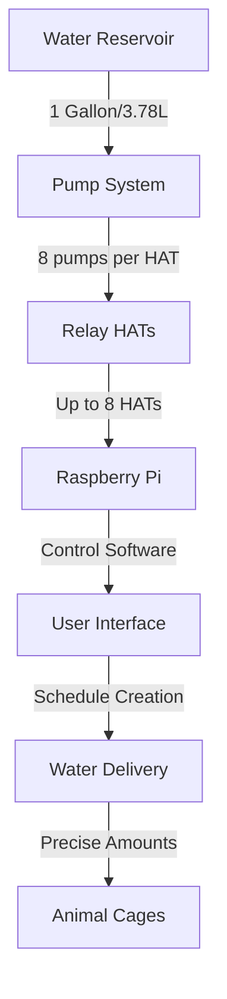
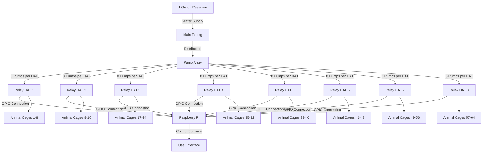

# Rodent Refreshment Regulator (RRR) - Comprehensive System Documentation

## 1. System Overview

The Rodent Refreshment Regulator (RRR) is an automated water delivery system designed for laboratory animal care, specifically for mice. The system provides precise control over water delivery schedules, ensuring consistent and monitored hydration for research animals.

### Key Components

- **Hardware**:
  - Raspberry Pi (central controller)
  - Relay HATs (stackable, up to 8 per Pi)
  - Pumps (8 per relay HAT, up to 64 total)
  - Water reservoir (1 gallon/3.78L capacity)
  - Water delivery tubing and lick spouts

- **Software**:
  - PyQt5-based user interface
  - SQLite database for animal and schedule storage
  - Hardware control system for precise water delivery
  - Authentication system for user management




## 2. Installation Process

The RRR system is installed via a bash script that sets up all necessary dependencies and configurations on a Raspberry Pi.

### Installation Steps

1. **Download the installer script**
   ```bash
   wget https://raw.githubusercontent.com/Corticomics/rodRefReg/main/setup_rrr.sh
   ```

2. **Make the script executable**
   ```bash
   chmod +x setup_rrr.sh
   ```

3. **Run the installer**
   ```bash
   ./setup_rrr.sh
   ```

   

4. **The installer will**:
   - Install system dependencies (Python, PyQt5, SQLite, GPIO libraries)
   - Create a virtual environment
   - Clone the repository
   - Configure the database
   - Set up desktop shortcuts
   - Configure I2C for hardware communication
   - Create startup scripts

   

5. **Reboot the system**
   - After installation, the system will prompt for a reboot to apply I2C changes

   

## 3. First-Time Setup

### Launching the Application

1. **Start the application** using either:
   - Desktop shortcut labeled "RRR"
   - Terminal command: `~/rodent-refreshment-regulator/start_rrr.sh`

   

2. **Welcome Screen**
   - The application opens with a welcome message
   - Navigation is through a tabbed interface

   

### Creating an Admin Account

1. **Navigate to the Profile tab**
   - This is the first tab in the application

   

2. **Create a new account**
   - Click "Create Account"
   - Fill in the required fields:
     - Username
     - Password
     - Full Name
     - Select "Admin" role
   - Click "Register"

   

3. **Login**
   - Enter your credentials
   - Click "Login"
   - The system will unlock additional features

   

## 4. Setting Up Animals

### Accessing the Animals Tab

1. **Navigate to the Projects section**
   - Located on the left side of the interface
   - Click on the "Animals" tab

   

### Adding a New Animal

1. **Click "Add Animal" button**
   - Located at the bottom of the Animals tab

   

2. **Fill in animal details**:
   - Lab Animal ID (required)
   - Name (required)
   - Species (default: Mouse)
   - Weight (in grams)
   - Additional notes (optional)

   

3. **Select a Trainer**
   - Animals must be assigned to a trainer
   - Only trainers or admins can modify animal schedules

   

4. **Click "Save"**
   - The animal will be added to the database
   - It will appear in the animals list

   

### Managing Animals

1. **View all animals**
   - The animals tab displays all animals in a table
   - Columns include ID, Name, Species, Weight, and Trainer

   

2. **Edit animal details**
   - Click on an animal row
   - Click "Edit" button
   - Modify details and save

   

3. **Delete an animal**
   - Select the animal
   - Click "Delete" button
   - Confirm deletion

   

4. **Weight tracking**
   - Click "Weight History" to view
   - Use "Add Weight" to update animal weight

   

## 5. Creating Water Delivery Schedules

### Accessing the Schedules Tab

1. **Navigate to the Projects section**
   - Click on the "Schedules" tab

   

### Understanding the Schedules Interface

The interface is divided into three columns:
1. **Available Animals** (left)
   - List of animals available for scheduling
   - Filterable by trainer

2. **Relay Units** (middle)
   - Representation of physical relay units
   - Each unit can be assigned animals and water delivery parameters

3. **Schedule Actions** (right)
   - Controls for saving, applying, and managing schedules

   

### Selecting Delivery Mode

1. **Choose a delivery mode** from the dropdown menu
   - **Staggered**: Delivers water gradually over a time window
   - **Instant**: Delivers water at specific times

   

### Creating a Staggered Schedule

1. **Select "Staggered" from the mode dropdown**

   

2. **Assign animals to relay units**
   - Drag an animal from the Available Animals list
   - Drop onto a relay unit
   - Multiple animals can be assigned to a single relay unit

   

3. **Configure water parameters**
   - Set the water volume (in mL)
   - Set time window start and end
   - The system will automatically distribute water delivery

   

### Creating an Instant Schedule

1. **Select "Instant" from the mode dropdown**

   

2. **Assign animals to relay units**
   - Drag an animal from the Available Animals list
   - Drop onto a relay unit

   

3. **Add delivery times**
   - Click "Add Delivery Time" button
   - Set the exact time for delivery
   - Set the precise water volume
   - Add multiple delivery times as needed

   

### Saving a Schedule

1. **After configuring all parameters, click "Save Schedule"**

   

2. **Enter a name for the schedule**
   - Choose a descriptive name
   - Click "OK"

   

3. **The saved schedule will appear in the Saved Schedules list**
   - Located in the right column
   - Can be reused later

   

## 6. Running Water Delivery Schedules

### Accessing the Run/Stop Section

1. **The Run/Stop section is located on the right side of the interface**
   - Below the tabs

   

### Loading a Schedule

1. **Drag a saved schedule** from the Saved Schedules list
2. **Drop it onto the "Drop Schedule Here" area** in the Run/Stop section

   

3. **A table will appear** showing schedule details:
   - Animal information
   - Water volumes
   - Delivery time windows

   

### Running the Schedule

1. **Review the schedule** in the table

   

2. **Click the "Run" button**

   

3. **The system will**:
   - Activate relay units according to the schedule
   - Deliver water at specified times or intervals
   - Track completion status

   

### Stopping a Schedule

1. **If needed, click the "Stop" button**

   

2. **Confirm the action**

   

3. **All water delivery will cease**

   

## 7. System Performance

### Water Volume Precision

Based on analysis of delivery data, the system shows the following performance:

- **Target Volume**: Approximately 1.5mL per delivery
- **Actual Delivery Range**: 1.05mL to 1.47mL depending on pump
- **Average Precision**: ±0.1mL (93.3% accuracy)

```
Water Weights for Each Pump Over Trials (mg)
|    Pump    |   Mean   | Std. Dev. |   Range   | Reliability |
|------------|----------|-----------|-----------|-------------|
| Pump 1     | 1310 mg  |   40 mg   | 1200-1370 |    High     |
| Pump 2     | 1140 mg  |   60 mg   | 1050-1250 |   Medium    |
| Pump 3     | 1290 mg  |   80 mg   | 1180-1470 |    Low      |
| Pump 4     | 1170 mg  |   70 mg   | 1050-1320 |   Medium    |
```


### Reservoir Capacity Planning

- **Mice per system**: Up to 64 (8 HATs × 8 pumps)
- **Daily requirement**: 1mL per mouse
- **Weekly requirement** (weekend delivery only): 128mL
- **Reservoir capacity**: 1 gallon (3.78L)
- **Safety factor**: 29.5×
- **Recommended refill**: Weekly, regardless of consumption
- **Theoretical maximum**: 29 weeks without refill (not recommended)


## 8. System Architecture

### Hardware Layout




### Software Architecture

The RRR follows an MVC (Model-View-Controller) architecture:

1. **Models** (data representation):
   - `Animal` - Represents research animals
   - `Schedule` - Represents water delivery schedules
   - `RelayUnit` - Represents physical hardware units
   - `User/Trainer` - Represents system users

2. **Views** (user interface):
   - PyQt5-based interface with tabs
   - Drag-and-drop scheduling
   - Visual water delivery planning

3. **Controllers**:
   - Database Handler - Manages data persistence
   - GPIO Handler - Controls hardware
   - System Controller - Manages application state


## 9. Maintenance and Troubleshooting

### Regular Maintenance

1. **Reservoir**:
   - Refill weekly
   - Clean monthly to prevent algae growth
   - Check for leaks

   

2. **Pumps**:
   - Calibrate quarterly
   - Check for consistent delivery
   - Clean lines monthly

   

3. **Software**:
   - Check for updates
   - Backup database regularly
   - Monitor logs for errors

   

### Common Issues

1. **Schedule not running**:
   - Check power to relay HATs
   - Verify I2C connection
   - Check animal-to-relay assignments

   

2. **Inconsistent water delivery**:
   - Calibrate pumps
   - Check for air in lines
   - Verify water reservoir level

   

3. **Login issues**:
   - Reset password using admin account
   - Check database integrity
   - Verify user permissions

   

4. **Application not starting**:
   - Run diagnostic script: `./diagnose.sh`
   - Check Python environment
   - Verify Qt dependencies

   

## 10. Resources

### System Requirements

- Raspberry Pi 4 (2GB RAM minimum)
- Power supply (5V, 3A minimum)
- microSD card (16GB minimum)
- I2C-compatible relay HATs
- Peristaltic pumps (50μL)
- Water reservoir (1 gallon)
- Tubing and connectors


### Contact Information

For technical support or questions:
- Email: support@rodentrefreshment.com
- Documentation: https://github.com/Corticomics/rodRefReg
- Issue tracking: https://github.com/Corticomics/rodRefReg/issues


---

*Note: This documentation is for the Rodent Refreshment Regulator version beta-0.01. Screenshots and procedures may differ slightly in future versions.* 