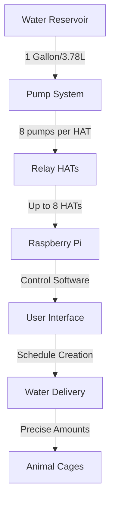
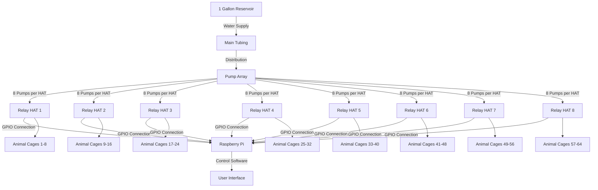

# Rodent Refreshment Regulator (RRR) - Comprehensive System Documentation

## 1. System Overview

The Rodent Refreshment Regulator (RRR) is an automated water delivery system designed for laboratory animal care, specifically for mice. The system provides precise control over water delivery schedules, ensuring consistent and monitored hydration for research animals.

### Key Components

- **Hardware**:
  - Raspberry Pi 4 (central controller)
  - Relay HATs (stackable; up to 8 per Pi)
  - Per-HAT layout: 15 animal channels + 1 master relay (relay 16) for pressurized delivery
  - Delivery hardware (either configuration):
    - Peristaltic pumps (legacy mode)
    - Solenoid valves + Teensy 4.1 flow-sensor bridge (current default — see `RRR_Delivery_Strategy_v2.md`)
  - Water reservoir (1 gallon / 3.78 L capacity)
  - Tubing and lick spouts
  - Optional IR drinking-detection module (per cage)

- **Software**:
  - PyQt5 desktop interface
  - SQLite database for animal, schedule, calibration, and cage-name storage
  - Per-valve / per-pump calibration with persistent factors
  - Authentication system with Admin / Lab User roles
  - Optional Slack notifications


```mermaid
graph TD
    A[Water Reservoir] -->|1 Gallon/3.78L| B[Pump System]
    B -->|8 pumps per HAT| C[Relay HATs]
    C -->|Up to 8 HATs| D[Raspberry Pi]
    D -->|Control Software| E[User Interface]
    E -->|Schedule Creation| F[Water Delivery]
    F -->|Precise Amounts| G[Animal Cages]
```


## 2. Installation Process

The RRR system is installed via a bash script that sets up all necessary dependencies and configurations on a Raspberry Pi.

### Installation Steps

1. **Run the one-line installer** from any directory on your Raspberry Pi:

   ```bash
   curl -fsSL https://raw.githubusercontent.com/Corticomics/rodRefReg/main/setup_rrr.sh | sudo bash
   ```

   

2. **The installer automatically**:
   - Detects your Raspberry Pi model and Pi OS variant
   - Installs system dependencies (Python, PyQt5, SQLite, I2C/GPIO libraries)
   - Creates a virtual environment under `~/rodent-refreshment-regulator/`
   - Clones the repository and configures the database
   - Enables and tests I2C on the appropriate bus for your Pi model
   - Installs the optional `rodent-regulator.service` systemd unit for unattended operation
   - Creates desktop shortcuts and a `start_rrr.sh` launcher

   

3. **Reboot when prompted** to apply I2C changes.

   

4. **Optional — enable 24/7 service mode**:

   ```bash
   ~/rodent-refreshment-regulator/toggle_service.sh
   ```

## 3. First-Time Setup

### Launching the Application

1. **Start the application** using either:
   - Desktop shortcut labeled "RRR"
   - Terminal command: `~/rodent-refreshment-regulator/start_rrr.sh`

   

2. **Welcome Screen**
   - The application opens with a welcome message
   - Navigation is through a tabbed interface

   

### Creating an Admin Account

On first launch the app opens in **guest mode**, with most controls gated behind a login overlay (`LoginGateWidget`).

1. **Open the Users tab**

   

2. **Create a new account**
   - Click **Create Account**
   - Fill in the required fields:
     - Username
     - Password
     - Full Name
     - Role (the first account created should be **Admin**)
   - Click **Register**

   

3. **Login**
   - Enter your credentials and click **Login**
   - The login gate unlocks the Schedules / Animals / Wizard / Cages tabs and the Run/Stop controls

   

## 4. Setting Up Animals

### Accessing the Animals Tab

1. **Navigate to the Projects section**
   - Located on the left side of the interface
   - Click on the "Animals" tab

   

### Adding a New Animal

1. **Click "Add Animal" button**
   - Located at the bottom of the Animals tab

   

2. **Fill in animal details**:
   - Lab Animal ID (required)
   - Name (required)
   - Species (default: Mouse)
   - Weight (in grams)
   - Additional notes (optional)

   

3. **Select a Trainer**
   - Animals must be assigned to a trainer
   - Only trainers or admins can modify animal schedules

   

4. **Click "Save"**
   - The animal will be added to the database
   - It will appear in the animals list

   

### Managing Animals

1. **View all animals**
   - The animals tab displays all animals in a table
   - Columns include ID, Name, Species, Weight, and Trainer

   

2. **Edit animal details**
   - Click on an animal row
   - Click "Edit" button
   - Modify details and save

   

3. **Delete an animal**
   - Select the animal
   - Click "Delete" button
   - Confirm deletion

   

4. **Weight tracking**
   - Click "Weight History" to view
   - Use "Add Weight" to update animal weight

   

## 5. Cages and Schedules

The schedule UI consists of three coordinated tabs in the Projects section:

| Tab | Purpose |
|-----|---------|
| **Schedules** | Hub of schedule cards (search, edit, delete, drag-to-run) |
| **Wizard** | Step-by-step creation/editing of a schedule |
| **Cages** | Visual relay-board map for naming cages |

### 5.1 Naming Cages

1. Open the **Cages** tab to see the physical relay layout (animal channels in color, master relay highlighted separately).

   

2. Click any cage tile, enter a descriptive name (e.g., "Rack A — Cage 3"), and save.

3. Cage names propagate automatically to the Wizard, the Schedules hub, and the Calibration table.

### 5.2 Creating a Schedule (Wizard)

The wizard is a 4-step guided flow. Open it from the **Wizard** tab or by clicking **+ New Schedule** in the Schedules hub.

1. **Step 1 — Type**: pick **Instant** (deliver at specific times) or **Staggered** (split a volume uniformly across a time window).

   

2. **Step 2 — Animals**: multi-select animals/cages from the Available list. The wizard enforces hardware limits (15 cages × number of HATs; the master relay is excluded automatically).

   

3. **Step 3 — Parameters**: set the schedule name, per-animal volume, time window or specific delivery times.

   

4. **Step 4 — Review**: confirm everything and click **Save Schedule**. The new schedule appears as a card in the Schedules hub.

   

### 5.3 Managing Schedules (Hub)

The **Schedules** tab is a grid of schedule cards with a debounced search bar.

- **Edit**: opens the same wizard-style editor (`ScheduleEditDialog`) so you can tweak any field
- **Info**: shows the full schedule details (animals, volumes, windows)
- **Delete**: single delete from the card menu, or enable multi-select mode for bulk delete
- **Drag**: drag the card onto the Run/Stop drop area to queue it for execution

   

## 6. Running Water Delivery Schedules

### Accessing the Run/Stop Section

1. **The Run/Stop section is located on the right side of the interface**
   - Below the tabs

   

### Loading a Schedule

1. **Drag a schedule card** from the Schedules hub onto the **Drop Schedule Here** area in the Run/Stop section.

   

2. A summary table appears showing animals, volumes, and delivery windows.

   

### Running the Schedule

1. Review the loaded schedule.

   

2. Click **Run Program**. Hardware is initialized lazily on a worker thread, so the UI remains responsive.

   

3. The **Execution Monitor** tab appears next to the Terminal and shows one card per cage with live progress. The system:
   - Validates the time window before each pulse
   - Activates relays according to the schedule
   - Streams flow-sensor data (solenoid mode) or pulse counts (peristaltic mode)
   - Auto-hides the monitor after completion

   

### Stopping a Schedule

1. **If needed, click the "Stop" button**

   

2. **Confirm the action**

   

3. **All water delivery will cease**

   

## 7. System Performance

### Water Volume Precision

Based on analysis of delivery data, the system shows the following performance:

- **Target Volume**: Approximately 1.5mL per delivery
- **Actual Delivery Range**: 1.05mL to 1.47mL depending on pump
- **Average Precision**: ±0.1mL (93.3% accuracy)

```
Water Weights for Each Pump Over Trials (mg)
|    Pump    |   Mean   | Std. Dev. |   Range   | Reliability |
|------------|----------|-----------|-----------|-------------|
| Pump 1     | 1310 mg  |   40 mg   | 1200-1370 |    High     |
| Pump 2     | 1140 mg  |   60 mg   | 1050-1250 |   Medium    |
| Pump 3     | 1290 mg  |   80 mg   | 1180-1470 |    Low      |
| Pump 4     | 1170 mg  |   70 mg   | 1050-1320 |   Medium    |
```


### Reservoir Capacity Planning

- **Mice per system**: Up to 64 (8 HATs × 8 pumps)
- **Daily requirement**: 1mL per mouse
- **Weekly requirement** (weekend delivery only): 128mL
- **Reservoir capacity**: 1 gallon (3.78L)
- **Safety factor**: 29.5×
- **Recommended refill**: Weekly, regardless of consumption
- **Theoretical maximum**: 29 weeks without refill (not recommended)


## 8. System Architecture

### Hardware Layout


```mermaid
graph TD
    A[1 Gallon Reservoir] -->|Water Supply| B[Main Tubing]
    B -->|Distribution| C[Pump Array]
    C -->|8 Pumps per HAT| D[Relay HAT 1]
    C -->|8 Pumps per HAT| E[Relay HAT 2]
    C -->|8 Pumps per HAT| F[Relay HAT 3]
    C -->|8 Pumps per HAT| G[Relay HAT 4]
    C -->|8 Pumps per HAT| H[Relay HAT 5]
    C -->|8 Pumps per HAT| I[Relay HAT 6]
    C -->|8 Pumps per HAT| J[Relay HAT 7]
    C -->|8 Pumps per HAT| K[Relay HAT 8]
    D & E & F & G & H & I & J & K -->|GPIO Connection| L[Raspberry Pi]
    L -->|Control Software| M[User Interface]
    D --> D1[Animal Cages 1-8]
    E --> E1[Animal Cages 9-16]
    F --> F1[Animal Cages 17-24]
    G --> G1[Animal Cages 25-32]
    H --> H1[Animal Cages 33-40]
    I --> I1[Animal Cages 41-48]
    J --> J1[Animal Cages 49-56]
    K --> K1[Animal Cages 57-64]
```


### Software Architecture

The RRR follows an MVC (Model-View-Controller) architecture:

1. **Models** (data representation):
   - `Animal` - Represents research animals
   - `Schedule` - Represents water delivery schedules
   - `RelayUnit` - Represents physical hardware units
   - `User/Trainer` - Represents system users

2. **Views** (user interface):
   - PyQt5 tabbed interface (`gui.py`)
   - Schedules Hub + Wizard pair (`schedules_hub.py`, `schedule_wizard.py`)
   - Cages Visualization tab (`cages_visualization_tab.py`)
   - Settings sub-tabs: Delivery / Calibration / Priming / General (`SettingsTab.py`)
   - Calibration Wizard (`CalibrationWizard.py`)
   - Priming Control widget (`PrimingControlWidget.py`)
   - Execution Monitor / Schedule Progress Tracker (`ScheduleProgressTracker.py`)

3. **Controllers & Strategies**:
   - `database_handler.py` — persistence layer
   - `system_controller.py` — application state
   - `WateringController.py`, `schedule_controller.py`, `pump_controller.py`, `delivery_queue_controller.py`
   - `strategies/solenoid_flow_strategy.py` — solenoid + flow-sensor delivery
   - `drivers/uart_flow_sensor.py` — Teensy bridge for SLF3S-0600F flow sensor
   - `gpio/relay_worker.py` — runs delivery on a worker thread with lazy hardware init
   - `ir_module/` — optional IR drinking-detection extension


## 9. Maintenance and Troubleshooting

### Regular Maintenance

1. **Reservoir**:
   - Refill weekly
   - Clean monthly to prevent algae growth
   - Check for leaks

   

2. **Pumps**:
   - Calibrate quarterly
   - Check for consistent delivery
   - Clean lines monthly

   

3. **Software**:
   - Check for updates
   - Backup database regularly
   - Monitor logs for errors

   

### Common Issues

1. **Schedule not running**:
   - Check power to relay HATs
   - Verify I2C connection
   - Check animal-to-relay assignments

   

2. **Inconsistent water delivery**:
   - Calibrate pumps
   - Check for air in lines
   - Verify water reservoir level

   

3. **Login issues**:
   - Reset password using admin account
   - Check database integrity
   - Verify user permissions

   

4. **Application not starting**:
   - Run diagnostic script: `./diagnose.sh`
   - Check Python environment
   - Verify Qt dependencies

   

## 10. Resources

### System Requirements

- Raspberry Pi 4 (2GB RAM minimum)
- Power supply (5V, 3A minimum)
- microSD card (16GB minimum)
- I2C-compatible relay HATs
- Peristaltic pumps (50μL)
- Water reservoir (1 gallon)
- Tubing and connectors


### Contact Information

For technical support or questions:
- Email: support@rodentrefreshment.com
- Documentation: https://github.com/Corticomics/rodRefReg
- Issue tracking: https://github.com/Corticomics/rodRefReg/issues


---

*Note: This documentation is for the Rodent Refreshment Regulator version beta-0.01. Screenshots and procedures may differ slightly in future versions.* 