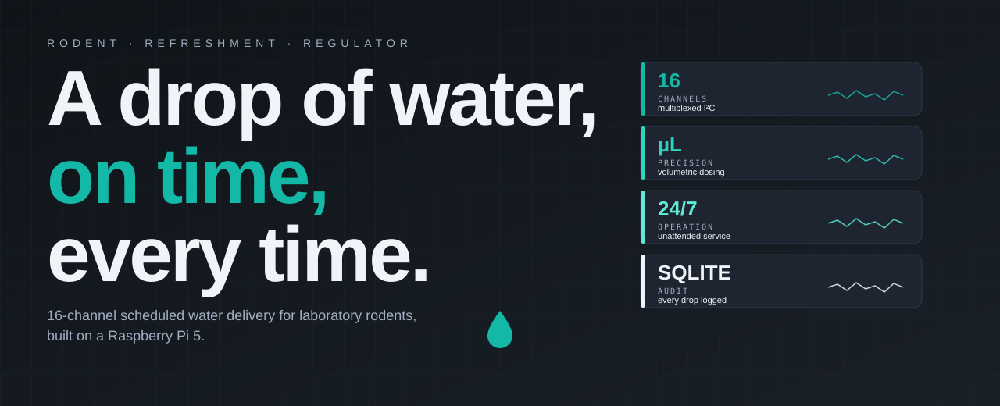

# Rodent Refreshment Regulator (RRR)

**A Simple Water Delivery System for Laboratory Animal Care**

<p align="center">
  
</p>

## What is the Rodent Refreshment Regulator?

<p align="center">
  
</p>

The Rodent Refreshment Regulator (RRR) helps you automatically deliver precise amounts of water to laboratory animals on a schedule. It takes the guesswork out of water delivery and ensures your research animals receive consistent care.

**No programming knowledge needed!** The system has a simple, user-friendly interface designed for laboratory staff with any level of technical experience.

## Why Use the RRR System?

- **Consistent Care**: Delivers precise water amounts every time
- **Time-Saving**: Automates routine water delivery tasks
- **Animal Welfare**: Ensures animals receive proper hydration
- **Research Quality**: Improves consistency in experimental conditions
- **Remote Monitoring**: Sends alerts about system status

## Getting Started: Step-by-Step Guide

### 1. Setting Up Your System

If the system is already installed in your lab, skip to [Using the Application](#2-using-the-application). If you are building a new device from parts, follow the full bench-build runbook in [HARDWARE_SETUP.md](Project/docs/HARDWARE_SETUP.md) before running the software installer below.

**Requirements**: Raspberry Pi running **Raspberry Pi OS Bookworm (64-bit)** with internet access.

#### One-line install (recommended)

Open a terminal on your Raspberry Pi and run:

```bash
curl -fsSL https://raw.githubusercontent.com/Corticomics/rodRefReg/main/bootstrap.sh | bash
```

That command downloads a small bootstrap script, which installs `git`, clones the repository into `~/rodRefReg`, and then runs the full installer non-interactively. The whole process takes ~5–10 minutes on a fresh Pi (sudo password prompted once for apt).

To preview without changing anything:

```bash
curl -fsSL https://raw.githubusercontent.com/Corticomics/rodRefReg/main/bootstrap.sh | bash -s -- --dry-run
```

#### Manual install

If you'd rather audit the code before running it, or you already have the repo cloned:

```bash
git clone https://github.com/Corticomics/rodRefReg.git ~/rodRefReg
cd ~/rodRefReg
./install.sh
``` 
It will:

- Install all system and Python dependencies
- Enable I²C (via `raspi-config`) without requiring a reboot
- Compile and install the Sequent Microsystems 16-relay HAT driver
- Set up a stable `/dev/teensy_flow` symlink for the Teensy flow sensor (via udev)
- Create a desktop icon, an application-menu entry, and a systemd `--user` service for autostart
- Verify every Python import and the relay HAT CLI before exiting

**Useful installer flags** (work after `./install.sh` or after `bash -s --` in the curl form):

| Flag | Purpose |
|---|---|
| `--dry-run` | Print every action without changing anything (safe to try first) |
| `-y` / `--yes` | Non-interactive mode |
| `--only <module>` | Run a single stage, e.g. `--only 40-hardware` |
| `--skip <module>` | Skip a stage, repeatable |
| `--branch <name>` | Install from a non-`main` branch |
| `--help` | Full usage |

**After install**: log out and back in once (so the new `i2c`, `gpio`, `dialout` group memberships apply), then launch via the desktop icon or `~/.local/bin/rrr`. Reboot only if you want the `consoleblank=0` boot setting to take effect.

Logs from every install run live under `~/.local/state/rrr/install-<timestamp>.log`.

## Documentation

This README is the entry point. Topic-specific runbooks live in
[`Project/docs/`](Project/docs/); each is linked once below so this file stays the single
table of contents you need to bookmark.

| Document | When to read it |
|---|---|
| [HARDWARE_SETUP.md](Project/docs/HARDWARE_SETUP.md) | Building a device from parts: Pi, relay HAT, valves, power, common ground, tubing, wall mount. Read this first for any new install. |
| [16-RELAYS Vendor Manual (PDF)](Project/docs/16-RELAYS-UsersGuide_d5e24457-bdd9-4e16-a307-7f90bbd668bb.pdf) | Authoritative reference for the Sequent Microsystems relay HAT (jumpers, stack levels, I²C addresses). |
| [QUICK_REFERENCE.md](QUICK_REFERENCE.md) | Day-to-day operator cheatsheet (animals, schedules, cages, shortcuts). |
| [CALIBRATION_QUICK_START.md](Project/docs/CALIBRATION_QUICK_START.md) | Calibrating a valve in about 10 minutes with the in-app wizard. |
| [VALVE_CALIBRATION_GUIDE.md](Project/docs/VALVE_CALIBRATION_GUIDE.md) | Technical reference behind the calibration wizard (algorithm, schema, API). |
| [PRIMING_FEATURE_DOCUMENTATION.md](Project/docs/PRIMING_FEATURE_DOCUMENTATION.md) | Priming control architecture and safety interlocks. |
| [TOPOLOGY_VALIDATION.md](Project/docs/TOPOLOGY_VALIDATION.md) | Proving an independent (one syringe per animal) rig against the manifold rig: pre-declared criteria C1–C9, bench recipe, and the tools that grade the weighings. |
| [DEVELOPMENT.md](Project/docs/DEVELOPMENT.md) | Software architecture, modules, data flow, and dev-environment setup. |
| [DATABASE.md](Project/docs/DATABASE.md) / [DATABASE_ARCHITECTURE.md](Project/docs/DATABASE_ARCHITECTURE.md) | SQLite schema, ERD, and `DatabaseHandler` reference. |
| [STOP_AND_PARTIAL_DELIVERY.md](Project/docs/STOP_AND_PARTIAL_DELIVERY.md) | Design of v2.0.0's Stop, CLOSE ALL RELAYS availability, run history and the Animals tab's last-run column (for maintainers). |
| [MAINTENANCE.md](Project/docs/MAINTENANCE.md) | Release, versioning (SemVer for RRR), tagging, and recovery procedures. |
| [UPDATE_SYSTEM.md](Project/docs/UPDATE_SYSTEM.md) | Full design of the in-app update pipeline (bundle format, blue-green layout, boot sentinel). |
| [CLAUDE.md](CLAUDE.md) | One-page hard-rules summary for maintainers and AI assistants. |
| [STL Files](Project/docs/STL%20Files/) | 3D-printable reservoir mounts, intra-cage water collectors, pump holders. |
---

### 2. Using the Application

#### First-Time Login

1. Start the RRR application by clicking the desktop icon or running `~/.local/bin/rrr`
2. You'll see a login screen - if you don't have an account, click "Create Account" to continue
3. The main screen will appear with several tabs

#### Adding Your Animals

1. Go to the **Animals** tab
2. Click **Add Animal**
3. Enter the animal's information as requested
4. Click **Save**
5. Repeat for each animal

#### Naming Cages

1. Go to the **Cages** tab to see a visual layout of the relay board
2. Double-click any cage tile, type a custom name (e.g., "Rack A — Cage 3") and press Enter
3. Names sync automatically to the Wizard, Schedules, and Calibration views

#### Creating a Water Delivery Schedule

The **Schedule Wizard** walks you through schedule creation in 4 steps:

1. Go to the **Wizard** tab (or click **+ New Schedule** in the Schedules hub)
2. **Step 1 — Type**: Choose between:
   - **Instant Delivery**: All animals receive their volume at the same time; conflicting times are auto-queued
   - **Staggered Delivery**: The total volume is divided uniformly across the selected time window
3. **Step 2 — Animals**: Multi-select the animals/cages to include (limited by your hardware: 15 cages on the first HAT, because relay 16 is the master valve or, on an independent rig, reserved and unwired; 16 on each further HAT)
4. **Step 3 — Parameters**: Set per-animal volume, time window, and schedule name
5. **Step 4 — Review**: Confirm the configuration and click **Save Schedule**

The new schedule appears as a card in the **Schedules** hub.

#### Managing Schedules

- The **Schedules** tab is a hub that shows every schedule as a card with a search bar and multi-select for bulk delete
- Click **Edit** on any card to reopen the wizard-style editor
- Click **Info** for full schedule details

#### Starting Water Delivery

1. In the **Schedules** hub, drag a schedule card onto the **Run/Stop** drop area on the right
2. Click **Run**. In solenoid pulse mode (the default), Run refuses a schedule that waters a cage with no usable calibration measured under this device's valve topology: it shows *Valve calibration needed* with the cages to calibrate, and the schedule does not start
3. The **Execution Monitor** tab appears next to the Terminal and shows live per-cage progress
4. Monitor the terminal output or the Execution Monitor cards for real-time updates


#### Stopping the Program

1. Click **Stop** to halt water delivery
2. RRR closes every relay. If a relay HAT does not confirm, it shows **Relays Not Confirmed Off**: a valve may still be open, so disconnect the valve power supply, then check the relay HAT and its I²C connection

#### Unattended Operation

The RRR system is designed to run continuously even when you disconnect your display, keyboard, or mouse. For long-term experiments:

1. **Autostart on graphical login** — enable the user-level systemd service (do **not** run this as root):
   ```bash
   systemctl --user daemon-reload
   systemctl --user enable --now rrr.service
   ```

2. **Headless / no graphical login** — also enable user lingering so the service starts at boot:
   ```bash
   sudo loginctl enable-linger "$USER"
   ```

3. **Power management**: the installer adds `consoleblank=0` to `/boot/firmware/cmdline.txt` so the console will not blank during experiments. A reboot applies this.

4. **Status & logs**:
   ```bash
   systemctl --user status rrr.service
   journalctl --user -u rrr.service -f
   ```

5. **Stop / disable**:
   ```bash
   systemctl --user disable --now rrr.service
   ```

## Daily Use Guide

### Routine

1. **Check System Status**: Open the RRR application and verify it's running/Ran correctly
2. **Update Animal Weights**: Record new animal weights in the Animals tab
3. **Inspect Water Lines**: Check for any leaks or blockages
4. **Water Reservoir**: Ensure the water reservoir has sufficient clean water. On an independent rig (one syringe per animal), check every syringe line daily; a primed line holds about three days, so prime again (Settings → Priming) any line left idle over a long weekend


5. **Check Delivery Log**: Review the delivery history in the terminal
6. **Verify Schedules**: Confirm schedules for the next day
7. **Backup Data** (optional): Export/Import animal data if needed

## Common Questions

### What if the system isn't delivering water?

1. Check that **Run** has been clicked and the schedule started: if Run showed *Valve calibration needed* or *Cage not on this device*, calibrate the listed cages in **Settings → Calibration** (or edit the schedule) and press **Run** again
2. Verify that your time window is correct: a schedule whose end time has passed shows *Expired Schedule* and does not start; if only the start time has passed, RRR asks whether to run the rest of the window
3. Inspect the water tubes for air bubbles or blockages (make sure to prime the tubes and pumpos prior to first use)
4. Check that the water reservoir has enough water
5. Look in the Terminal tab for `[VALVE ERROR]`: the line says why that delivery stopped, most often a valve command that did not reach its relay HAT. Check the HAT (`sudo i2cdetect -y 1`); after fixing a HAT that was missing when RRR started, close and reopen RRR

### How do I know how much water each animal received?

You can watch each delivery in the Terminal tab. Every delivery is also written to the `dispensing_history` table (the delivery ledger): the dose asked for, the volume dispensed and its status. On the device, `cd ~/rrr/current/Project && ~/rrr/shared/venv/bin/python3 tools/gravimetric_check.py daily --since YYYY-MM-DD` prints each day's totals per cage.

### What if I need to change a schedule mid-experiment?

You can create a new schedule at any time. Stop the current program, create your new schedule, and start the program again with the new settings.

### How do I calibrate the system for accurate water delivery?

Go to **Settings → Calibration**. The table lists every cage, with the custom names you set in the Cages tab. Click **Calibrate** on a cage's row, or **Calibrate All Uncalibrated** to go through every cage that has no calibration yet, one marked **Invalid** (its volume per pulse or pulse width is missing, zero or invalid), or one marked **Stale** (measured under the other valve topology; one saved before v1.21.0 counts as shared manifold). Set the valve topology (**Settings → Delivery → Valve Topology**) before calibrating. For each cage the wizard:

1. Walks you through a pre-flight checklist (prime the tubing in the **Priming** sub-tab first if it holds air)
2. Fires a fixed number of pulses into a beaker at the pulse width and interval you set
3. Asks for the volume you weighed
4. Saves that cage's mL per pulse, with the valve topology it was measured under; every later delivery to the cage uses it. In solenoid pulse mode (the default), **Run** refuses a schedule that waters a cage with no calibration, an Invalid one or a Stale one

Calibrate before starting a new experiment and periodically to maintain accuracy. The **Priming** sub-tab in Settings can be used on its own any time you swap tubing, refill the reservoir or, on an independent rig, refill or replace a syringe. It is refused while a schedule or a calibration is running. Changing the valve topology restarts RRR, and Priming then shows the controls for the new topology; if RRR cannot restart itself, Priming cannot open a valve until RRR is closed and reopened.

### How do I resolve "i2c-1 not found" or other I²C errors?

The installer enables I²C automatically via `raspi-config nonint do_i2c 0`, which makes `/dev/i2c-1` (the GPIO HAT bus) appear without a reboot on every Pi 4 and Pi 5. If the relay HAT does not respond:

1. Confirm the bus is up:
   ```bash
   ls /dev/i2c-*           # /dev/i2c-1 must be in the list
   sudo i2cdetect -y 1     # the HAT should appear at its I²C address
   ```

2. If `/dev/i2c-1` is missing, re-run the hardware module of the installer (idempotent, ~5 s):
   ```bash
   cd ~/rodRefReg
   ./install.sh -y --only 40-hardware
   ```

3. If it is still missing, run the standalone helper and reboot:
   ```bash
   ~/rodRefReg/scripts/runtime/fix_i2c.sh
   sudo reboot
   ```

4. As a last resort, enable I²C interactively:
   ```bash
   sudo raspi-config       # → Interface Options → I2C → Enable
   ```

Different Raspberry Pi models expose different *internal* I²C bus numbers (Pi 5 also shows `/dev/i2c-13` and `/dev/i2c-14`), but the relay HAT always sits on bus 1.

### How can I run a Python script against the RRR install?

The application uses a virtual environment at `~/rrr/shared/venv`, and the running release lives in `~/rrr/current`. Always call that Python directly — do **not** rely on the system `python3`, which (on Bookworm) is intentionally locked down by PEP 668:

```bash
cd ~/rrr/current/Project
~/rrr/shared/venv/bin/python3 tools/gravimetric_check.py list
```

That example only reads the delivery ledger. Do **not** run `tests/test_relay_hat.py` on a plumbed rig: without arguments it switches every relay on, which opens every valve.

## Getting Help

If you need assistance with the RRR system:

1. Click the **Help** tab in the application for detailed guides
2. Use the search bar to find specific help topics
3. Contact your laboratory manager or IT support
4. For urgent issues, contact [zepaulojr2@gmail.com](mailto:zepaulojr2@gmail.com)

## Important Safety Notes

- Always monitor the system during the first few days of a new setup
- Check animals regularly to ensure they are receiving adequate hydration and to check if the hardware setup was made correctly do not leave the subjects by themselves for the first few uses to ensure correct software and hardware setup and safety 
- Keep water lines and pumps clean to prevent contamination
- Never modify the hardware without consulting technical staff

---

**Remember**: The RRR system is designed to assist with animal care, not replace regular monitoring. Always follow your institution's animal welfare guidelines and protocols.
